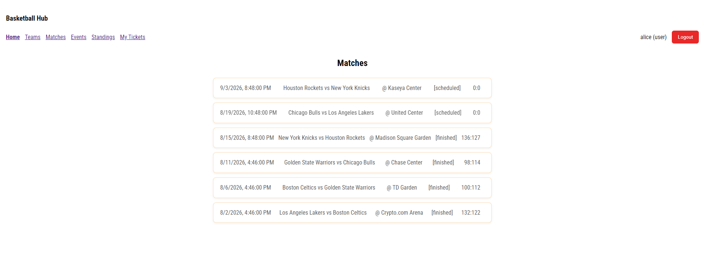
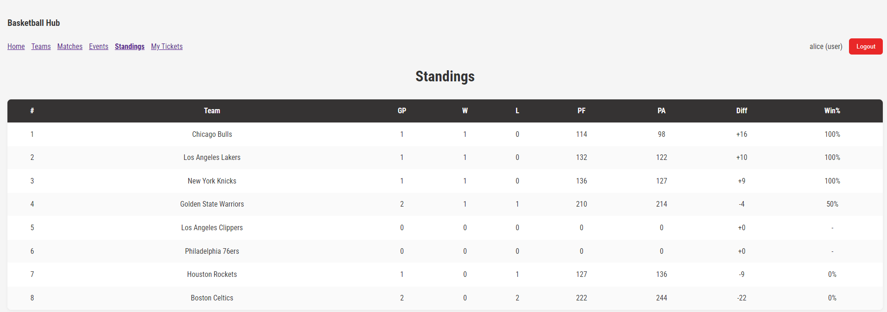
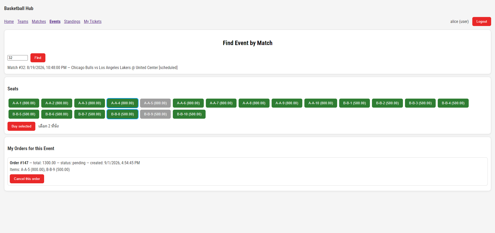
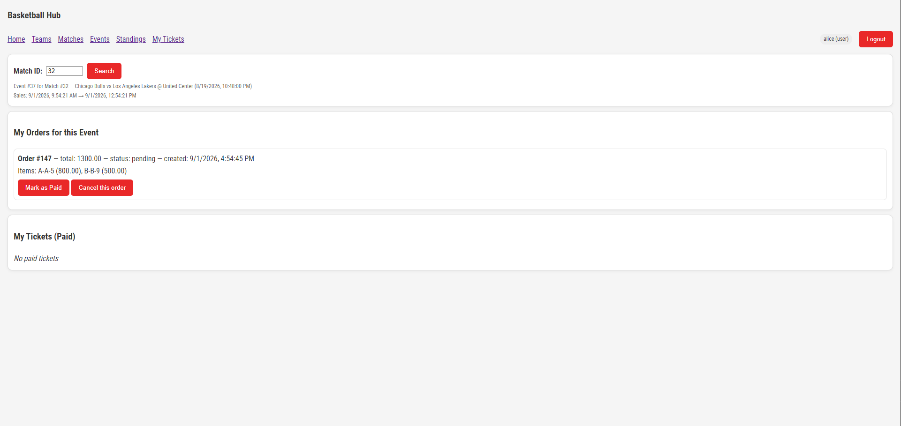

# Basketball Hub

เว็บแอปพลิเคชันจัดการลีกบาสเกตบอลและขายตั๋วออนไลน์ พัฒนาเป็นโปรเจกต์รายวิชา
<<< ใส่ชื่อวิชา/ปีการศึกษา >>>

ระบบครอบคลุมตั้งแต่การจัดการทีมและตารางแข่ง การคำนวณตารางคะแนนอัตโนมัติ
ไปจนถึงการเปิดขายตั๋วและเลือกที่นั่งรายที่

## Screenshots

### รายการแมตช์


### ตารางคะแนน (คำนวณอัตโนมัติจากผลการแข่งขัน)


### เลือกที่นั่ง


### ตั๋วของฉัน


## Tech Stack


Backend - Node.js, Express 4 
Database - PostgreSQL 
Frontend - HTML, CSS, JavaScript (vanilla, ไม่ใช้ framework) |
Authentication - JWT (jsonwebtoken), bcrypt |
Batch job - Java 17 + Maven (ทางเลือกสำหรับคำนวณตารางคะแนนนอกเวลาทำการ) |

## Features

**ผู้ใช้ทั่วไป (user)**
- ดูตารางแข่ง ผลการแข่งขัน และตารางคะแนน
- ค้นหารอบการขายตั๋วจากแมตช์ที่สนใจ
- เลือกที่นั่งหลายที่พร้อมกัน แล้วสร้างคำสั่งซื้อ
- ยืนยันการชำระเงิน หรือยกเลิกคำสั่งซื้อที่ยังไม่ชำระ
- ดูตั๋วที่ชำระแล้วพร้อมรายละเอียดแมตช์และที่นั่ง

**ผู้ดูแลระบบ (admin)**
- จัดการทีมและแมตช์
- บันทึกผลการแข่งขัน ตารางคะแนนคำนวณใหม่อัตโนมัติ
- เปิดรอบขายตั๋วและกำหนดผังที่นั่งพร้อมราคา
- ดูคำสั่งซื้อทั้งหมดของแต่ละรอบ ยกเลิกคำสั่งซื้อ หรือปล่อยที่นั่งคืน

การเข้าถึงแยกตาม role ด้วย JWT และ middleware ตรวจสิทธิ์ฝั่งเซิร์ฟเวอร์

## Getting Started

**ความต้องการ:** Node.js 18+, PostgreSQL 14+

```bash
# 1. ติดตั้ง dependencies
npm install

# 2. สร้างฐานข้อมูลและตาราง
createdb -U postgres basketball_hub
psql -U postgres -d basketball_hub -f sql/schema.sql
# Windows: หากขึ้น createdb is not recognized แปลว่า PostgreSQL bin ยังไม่อยู่ใน PATH ให้เพิ่มด้วยคำสั่งนี้แล้วเปิด terminal ใหม่
[Environment]::SetEnvironmentVariable("Path", [Environment]::GetEnvironmentVariable("Path","User") + ";C:\Program Files\PostgreSQL\18\bin", "User")
# หรือใช้ path เต็มแทน เช่น 
& "C:\Program Files\PostgreSQL\18\bin\createdb.exe" -U postgres basketball_hub

# 3. ตั้งค่า environment
cp .env.example .env
# แก้ DATABASE_URL ให้ตรงกับรหัสผ่าน PostgreSQL ของเครื่อง
# และตั้ง JWT_SECRET เป็นค่าสุ่ม เช่น
# node -e "console.log(require('crypto').randomBytes(32).toString('hex'))"

# 4. รันเซิร์ฟเวอร์
npm start        # หรือ npm run dev สำหรับ auto-reload
```

เปิด http://localhost:3000

**หมายเหตุ:** หากรหัสผ่าน PostgreSQL มีอักขระพิเศษ (`@`, `#`, `:`, `/`)
ต้องเข้ารหัสแบบ URL ใน `DATABASE_URL` เช่น `@` เขียนเป็น `%40`

### บัญชีทดสอบ

| Username | Password | Role |
| admin | Admin#1234 | admin |
| alice | User#1234 | user |

บัญชีเหล่านี้เก็บเป็น bcrypt hash ใน `auth/users.json` (สร้างใหม่ได้ด้วย `node scripts/make-users.js`)

## จุดที่น่าสนใจทางเทคนิค

### การป้องกันการจองที่นั่งซ้ำ

ปัญหาหลักของระบบขายตั๋วคือการจองพร้อมกัน หากใช้วิธีตรวจสอบสถานะที่นั่งแล้วค่อยอัปเดต
ผู้ใช้สองคนอาจอ่านค่า "ว่าง" ได้พร้อมกันก่อนที่ฝ่ายใดจะเขียนลงฐานข้อมูล ทำให้ที่นั่งเดียวถูกขายสองครั้ง

`services/ticketService.js` แก้ปัญหานี้ด้วยการห่อทั้งกระบวนการไว้ใน transaction
และล็อกแถวที่นั่งด้วย `SELECT ... FOR UPDATE NOWAIT` ก่อนตรวจสอบสถานะ

เลือก `NOWAIT` แทนการรอคิว เพราะในบริบทการขายตั๋วผู้ใช้ควรได้รับคำตอบทันที
ว่าที่นั่งถูกคนอื่นจองไปแล้ว ดีกว่าค้างรอโดยไม่รู้ผล ระบบจึงจับ error
จากการล็อกไม่สำเร็จแล้วแปลงเป็นข้อความที่ผู้ใช้เข้าใจได้

### การคำนวณตารางคะแนน

`recomputeStandings()` ใน `routes/standings.js` คำนวณสถิติทั้งลีกใหม่ทั้งหมด
จากแมตช์ที่มีสถานะ `finished` ด้วย SQL คำสั่งเดียว (CTE + `INSERT ... ON CONFLICT DO UPDATE`)
แทนการวนลูปอัปเดตทีละแมตช์

เลือกวิธีนี้เพราะผลลัพธ์ขึ้นกับข้อมูลปัจจุบันเสมอ ไม่สะสมความคลาดเคลื่อน
หากมีการแก้ไขหรือลบผลการแข่งขันย้อนหลัง ฟังก์ชันนี้ถูกเรียกอัตโนมัติทุกครั้งที่บันทึกผลการแข่งขัน

`java-utility/` เป็น implementation เดียวกันในรูปแบบ standalone batch job
สำหรับกรณีที่ต้องการรันเป็น scheduled task แยกจากเว็บเซิร์ฟเวอร์

## สิ่งที่ทราบว่ายังต้องปรับปรุง

**การตรวจสอบสิทธิ์ฝั่ง client ไม่ใช่การป้องกันจริง**
หน้าเว็บซ่อนเนื้อหาจากผู้ใช้ที่ยังไม่ล็อกอิน แต่ API สำหรับอ่านข้อมูล (`GET`)
ยังเปิดสาธารณะ ผู้ที่เรียก API โดยตรงยังเข้าถึงข้อมูลได้
ควรย้ายการตรวจสอบสิทธิ์ไปฝั่งเซิร์ฟเวอร์ให้ครบ

**ฟังก์ชัน `me()` ถอดรหัส JWT payload โดยไม่ตรวจลายเซ็น**
ใช้ได้สำหรับแสดงชื่อผู้ใช้บน UI แต่ทำให้หน้าเว็บยังคิดว่าผู้ใช้ล็อกอินอยู่
แม้ token จะหมดอายุหรือถูกเซ็นด้วย secret เก่า ควรเพิ่มการตรวจสอบกับเซิร์ฟเวอร์

**Route ที่เป็น async บางเส้นไม่มีการจัดการ error**
Express 4 ไม่จับ promise rejection ให้อัตโนมัติ หากฐานข้อมูลล่ม
โปรเซสจะหยุดทำงานทั้งเซิร์ฟเวอร์แทนที่จะตอบ 500 กลับไป
แผนคือเขียน `asyncHandler` wrapper ครอบทุก handler เพื่อรวมจุดจัดการ error ไว้ที่เดียว

**ข้อมูลจากฐานข้อมูลถูกแสดงผลด้วย `innerHTML` โดยไม่ escape**
ชื่อทีมหรือสนามที่มี HTML tag จะถูกตีความเป็น markup ควรเปลี่ยนไปใช้
`textContent` หรือเพิ่มฟังก์ชัน escape

**UX ของการค้นหายังผูกกับ ID ในฐานข้อมูล**
ผู้ใช้ต้องกรอก match ID เพื่อค้นหารอบขายตั๋ว ควรเปลี่ยนเป็นการเลือกจากรายการแมตช์

**ผังที่นั่งยังเป็นรายการปุ่มเรียงกัน**
ควรพัฒนาเป็นผังที่นั่งเชิงพื้นที่ที่สะท้อนตำแหน่งจริงในสนาม

## โครงสร้างโปรเจกต์

```
├── app.js              # entry point, mount routers
├── db.js               # PostgreSQL connection pool
├── routes/             # API endpoints
├── services/           # business logic (ticketService)
├── middleware/         # auth (JWT) และ rbac (role check)
├── public/             # frontend (HTML/CSS/JS)
├── sql/schema.sql      # โครงสร้างฐานข้อมูล
├── auth/users.json     # บัญชีผู้ใช้ (bcrypt hash)
└── java-utility/       # batch job คำนวณตารางคะแนน
```